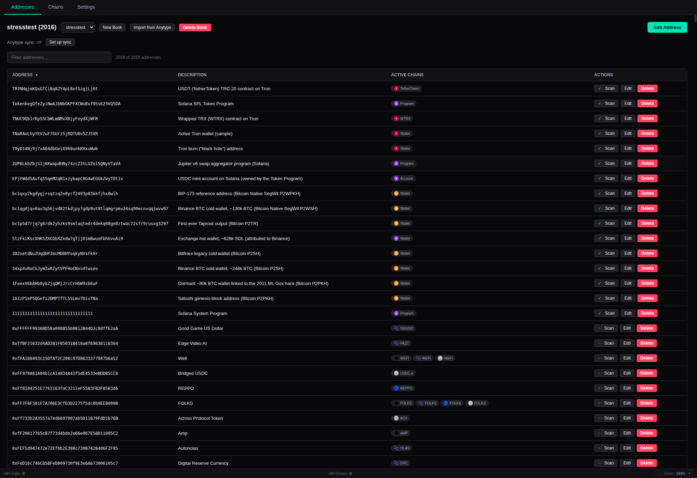

# EVM Address Book

[](https://github.com/gearcat0/evmaddressbook/actions/workflows/ci.yml)
[](https://github.com/gearcat0/evmaddressbook/blob/master/package.json)
[](#license)

A desktop application for managing crypto addresses and monitoring their on-chain activity — EVM chains plus Bitcoin, Solana, and Tron.



## Features

- **Address Management** — Add, edit, and delete addresses with descriptions; the chain family (EVM, Bitcoin, Solana, Tron) is auto-detected from the address format
- **Multiple Address Books** — Organize addresses into separate books; switch between them, create new ones, and delete them (the built-in "Default" book cannot be deleted)
- **Multi-Chain Scanning** — Detect activity across all Etherscan-supported EVM chains, plus Bitcoin (mempool.space), Solana (RPC), and Tron (TronGrid)
- **Multiple Data Providers** — Etherscan, direct JSON-RPC, Routescan, Blockscout, and Sourcify with automatic per-capability fallback; works without any API key
- **Address Type Discovery** — Identify whether each address is an EOA, contract, transparent proxy, or Gnosis Safe (with implementation address, Safe owners/threshold, contract creator); Bitcoin script types (P2PKH/P2SH/P2WPKH/P2WSH/P2TR), Solana wallets/programs/token accounts, and Tron wallets/contracts, with balances
- **Contract Storage** — ABI and source code saved locally for verified contracts
- **Chain Management** — View supported chains, edit RPC URLs, auto-fetch from chainlist.org
- **Anytype Sync** — Two-way sync of address books with [Anytype](https://anytype.io) collections
- **Chain Icons** — Visual chain identifiers with fallback letter icons
- **Dark Theme** — Purpose-built dark UI

## Tech Stack

- **Electron** — Desktop framework
- **React** — UI
- **electron-vite** — Build tooling
- **vitest** — Test runner
- **ethers.js** — EIP-55/base58 address handling and ABI decoding for Safe/proxy resolution
- **Etherscan API v2, JSON-RPC, Routescan, Blockscout, Sourcify** — EVM activity detection and contract metadata, with automatic fallback
- **mempool.space, Solana RPC, TronGrid** — Non-EVM chain scanning

## Getting Started

### Prerequisites

- Node.js 18+
- Optional: an Etherscan API key (free at [etherscan.io](https://etherscan.io/apis)) for higher EVM scan rate limits — the app works keyless via provider fallback

### Install & Run

```bash
npm install
npm run dev
```

### Tests

```bash
npm test
```

### Build

```bash
npm run build     # compile only
npm run preview   # preview the compiled app
```

### Release Packaging

Build distributable packages with [electron-builder](https://www.electron.build/):

```bash
npm run dist:linux   # AppImage + deb
npm run dist:mac     # dmg + zip
npm run dist:win     # NSIS installer + portable exe
```

Output goes to `release/`. Each platform should be built on its native OS.

### Configuration

The Etherscan API key can be set in the Settings tab or via environment variable:

```bash
ETHERSCAN_API_KEY=your_key npm run dev
```

Other environment variables:

| Variable | Description |
|----------|-------------|
| `ETHERSCAN_API_KEY` | Etherscan API key |
| `ROUTESCAN_API_KEY` | Routescan API key (optional fallback provider) |
| `TRONGRID_API_KEY` | TronGrid API key (Tron scanning) |
| `EVMADDRESSBOOK_DATADIR` | Custom data directory path |
| `EVMADDRESSBOOKDEBUG=1` | Enable debug logging |

### CLI

```bash
# List saved addresses
npm run build && node out/main/index.js --addresses

# List chains
node out/main/index.js --chains

# List address book names
node out/main/index.js --list-books

# Operate on a specific address book (defaults to "Default" when omitted)
node out/main/index.js --addresses --book Work
node out/main/index.js --rescan --book Work
```

## Data Storage

Data is stored as JSON files in a platform-specific directory:

| OS | Path |
|----|------|
| macOS | `~/Library/Application Support/evmaddressbook/` |
| Linux | `~/.local/evmaddressbook/` |
| Windows | `%APPDATA%\evmaddressbook\` |

Files:
- `addresses.json` — The "Default" address book (addresses with chain activity and type info)
- `addressbook_<base64url-name>.json` — Additional address books, one file per book
- `chains.json` — Chain list from Etherscan
- `settings.json` — API key and data directory config
- `icons/chains/` — Downloaded chain icons
- `contracts/{address}/{chainId}/` — Stored ABIs and source code

## Project Structure

```
src/
├── main/                        # Electron main process
│   ├── index.js                 # App entry, window creation
│   ├── ipc-handlers.js          # IPC request handlers
│   ├── chain-scanner.js         # Two-phase, family-aware chain scanning
│   ├── address-type-resolver.js # EOA/contract/proxy/Safe detection (EVM)
│   ├── providers/               # Data providers + fallback registry
│   │   ├── provider-registry.js # Capability-based orchestration with fallback
│   │   ├── provider-utils.js    # Rate limiting, retries, shared parsers
│   │   ├── etherscan|rpc|routescan|blockscout|sourcify-provider.js  # EVM
│   │   └── bitcoin|solana|tron-provider.js                          # Non-EVM
│   ├── builtin-chains.js        # Bundled Bitcoin/Solana/Tron chain records
│   ├── icon-fetcher.js          # Chain icon downloader
│   ├── data-store.js            # JSON persistence with atomic writes
│   ├── anytype-sync.js          # Two-way Anytype collection sync
│   ├── constants.js             # IPC channels, URLs, defaults
│   └── cli.js                   # CLI interface
├── shared/
│   └── address-validator.js     # Family detection + canonicalization (all chains)
├── preload/
│   └── index.js                 # Context bridge for renderer
└── renderer/
    ├── App.jsx                  # Tab-based layout
    ├── main.jsx                 # React entry point
    ├── logo.svg                 # App logo
    ├── components/
    │   ├── TabBar.jsx           # Navigation tabs
    │   ├── ChainIcon.jsx        # Chain icon with fallback
    │   ├── addresses/           # Address list, rows, badges, forms
    │   ├── chains/              # Chain table with editable RPC URLs
    │   └── settings/            # API key and data dir config
    ├── hooks/                   # useAddresses, useChains, useSettings, useSortFilter
    └── styles/index.css         # Dark theme
test/                            # vitest suite + stresstest fixture book
```

## Address Type Discovery

When scanning, each address on each active chain is classified:

| Family | Type | Details Stored |
|--------|------|---------------|
| EVM | **EOA** | `addressType: "eoa"` |
| EVM | **Contract** | Contract name, creator, creation tx hash |
| EVM | **TransparentUpgradeableProxy** | Implementation address (via EIP-1967 slot) |
| EVM | **GnosisSafeProxy** | Version, owners list, threshold |
| Bitcoin | **Wallet** | Script type (p2pkh/p2sh/p2wpkh/p2wsh/p2tr), tx count, balance |
| Solana | **Wallet / Program / Account** | Owner program, executable flag, balance |
| Tron | **Wallet / Contract** | Contract name, balance |

## License

ISC
